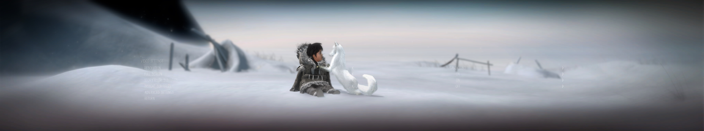

## Never Alone (Kisima Ingitchuna) ultrawide and wider fix

The small [patcher](/../../releases) removes the side black bars (pillarboxing) from the game at 21:9 and wider aspect ratios.

It does not address the native issue of the Cultural Insights FMVs being cropped. As a workaround, the videos can be watched properly at any time from the menu by switching to a 16:9 resolution in the game, or on YouTube.

Tested on the latest Epic Games Store version at 2560x1080 and 5760x1080. Steam patcher tested by czarman of WSGF.

You can buy me a [coffee](https://ko-fi.com/rozziroxx) or become a [patron](https://www.patreon.com/rozzi).
